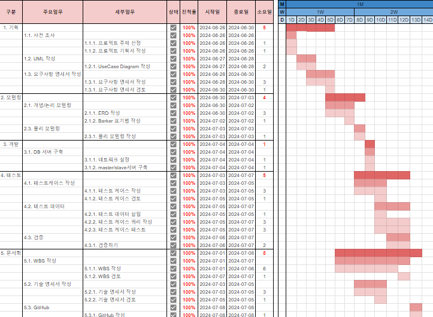
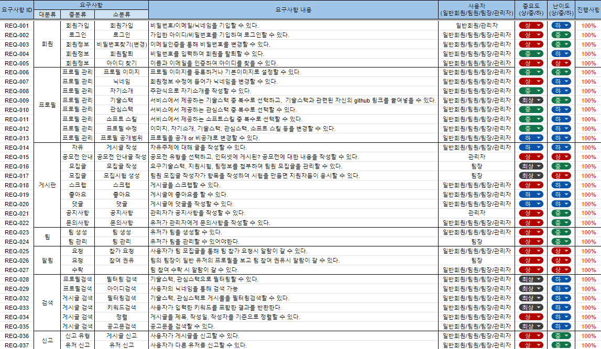
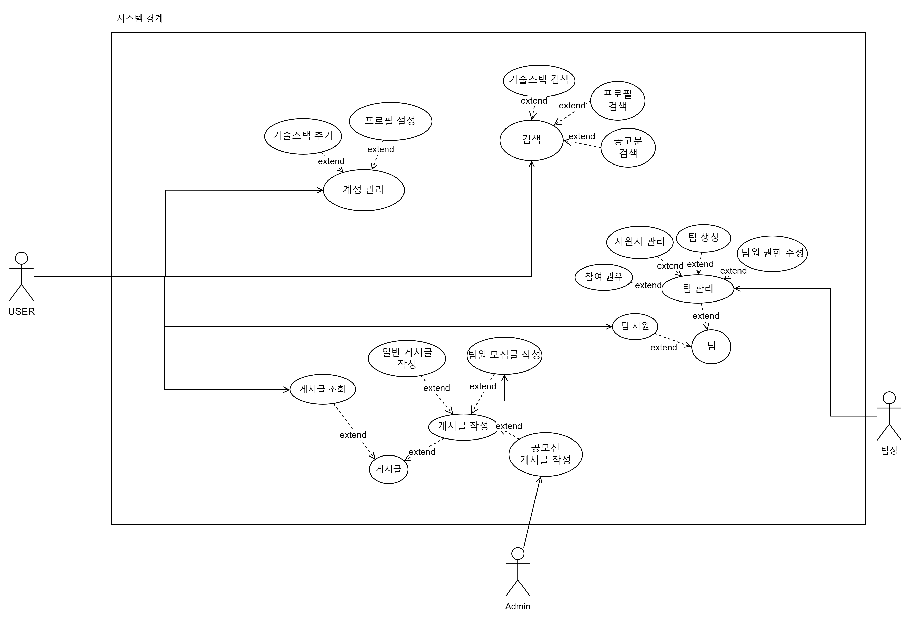
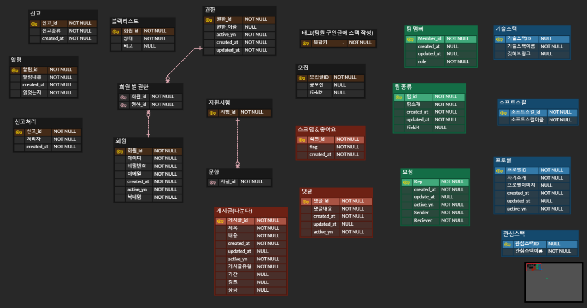
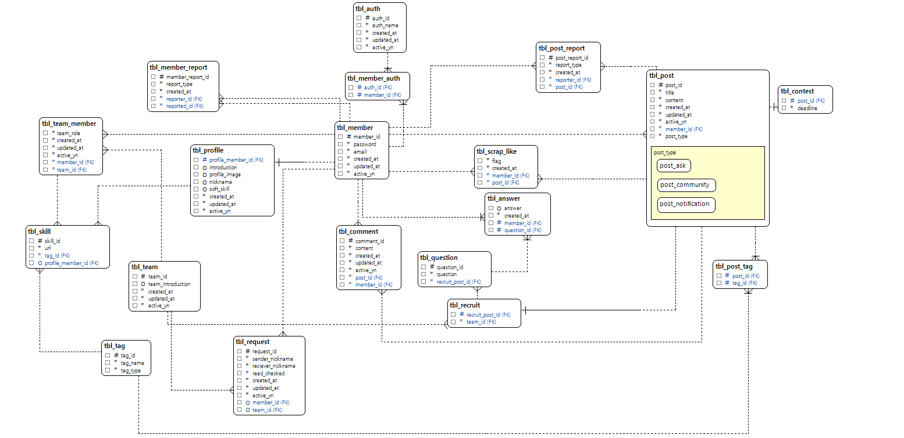
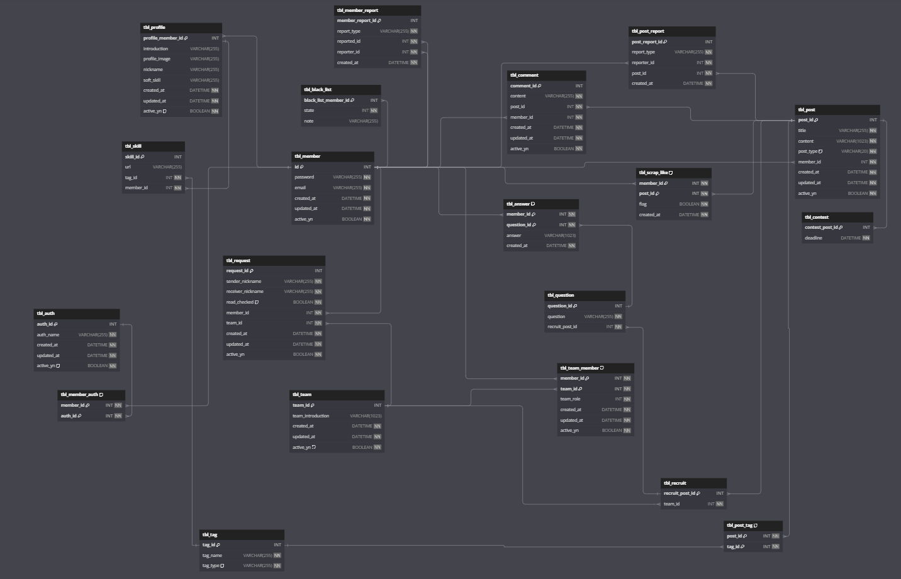
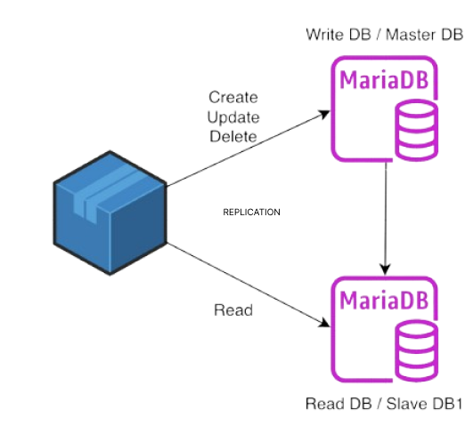
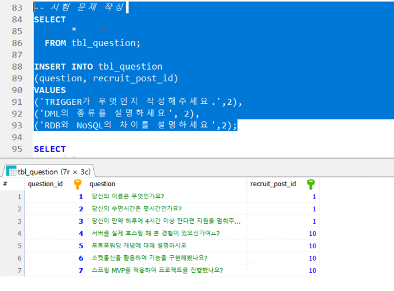
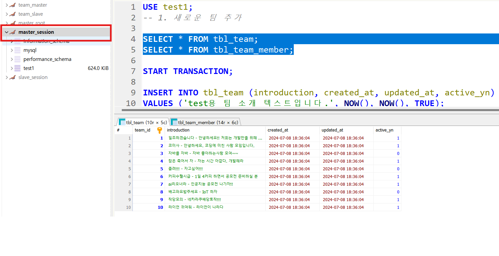

# 프로젝트 소개
> 효율적인 팀 빌딩을 위한 플랫폼 - 작당모의(Plotters)


### 팀 구성

| 김서현                                   | 김소리    | 용길한        | 장민근         | 정준서           |
| ------------------------------------- | ------ | ---------- | ----------- | ------------- |
| [1etterh](https://github.com/1etterh) | [sorrri](https://github.com/sorrri) | [Yong-ga-ri](https://github.com/Yong-ga-ri) | [caolian2003](https://github.com/caolian2003) | [JeongJunSeo99](https://github.com/JeongJunSeo99) |

## 프로젝트 배경
- IT  공모전 팀원 모집 플랫폼 기능이 제한적임
    1. 공모전 및 대외활동 참여를 위해 팀원 모집 시 **예비 팀원의 스펙 정보 부족**
    2. **이미 존재하는 공모전 팀에 참가 시, 참가 팀에 대한 정보 부족**
    3. 유저들이 제시하는 **실력에 대한 신뢰성이 보장되지 않음**

## 프로젝트 목적
- **커뮤니케이션 비용 ↓**
    -   공모전 팀원 모집에 참가하는 유저들은 모두 프로필을 작성하여 기존 오픈카톡, 구글폼 설문 등을 통해 플랫폼 외부적으로 실력을 확인해야하는 단계가 줄어듦

    - 프로필을 통해 원하는 유저나 팀을 찾는데 보다 효율적
- **유저 실력에 대한 신뢰도 보장**

    - 유저가 보유한 기술 수준을 ‘팀원 모집 시험’, ‘기술 스택이 포함된 본인 깃허브 링크’ 기능으로  보장된 신뢰 제공

## 기존 서비스와의 차별점
1. 프로필 설정을 통한 커뮤니케이션 비용 절감
2. 팀원 모집시 기술 스택, 포지션 설정 가능
3. 팀원 모집글에 질문 첨부 기능
4. 기술스택을 태그로 등록하여 필터링 검색 기능 제공


#### _references_
1. [_OKKY_](https://okky.kr/)
2. [_Hola_](https://holaworld.io/)
3. [_Beginmate_](https://beginmate.com/)
---

## 예상 이용자
- 공모전/프로젝트/스터디를 함께 할 팀원을 구하려는 학생

## 프로젝트 진행 과정
1. 5인 1조로 모여 회의 후 주제선정
2. 채택된 주제에 대한 요구사항 정의
3. 모델링작업
4. 모델링된 데이터베이스를 기반으로 서비스 시뮬레이션

---

### WBS


### 요구사항 분석


#### _FLOW CHART_


#### _UsecaseDiagram_


--- 

## 데이터베이스 모델링

### Entity 정의
> 요구사항 분석단계에서 명사를 추출하고 속성과 엔터티를 구분한다.


| 명사   | 구분        | 비고                                                                                                                   |
| ---- | --------- | -------------------------------------------------------------------------------------------------------------------- |
| 회원   | Entity    | 시스템 상의 역할은 관리자와 일반 회원으로 구분되며, 팀 내에서는 팀장과 팀원으로 구분된다.                                                                  |
| 권한   | Entity    | Guest: 로그인하지 않은 사람<br/>Admin: 관리자<br/>Undefined: 회원가입 후 기본 프로필 수정을 하지 않은 사람                                          |
| 프로필  | Entity    | 계정을 만들면 자동으로 생성되며, Nickname값은 undefined로 자동 부여된다. <br/>UPDATE 전까지 active_yn= FALSE                                   |
| 게시판  | Attribute | 게시글의 속성에 포함된다.(공지사항, 문의게시판, 모집글, 자유게시판)                                                                              |
| 게시글  | Entity    | 제목, 내용, 작성자 포함                                                                                                       |
| 댓글   | Entity    | 소속 게시글, 작성자                                                                                                          |
| 알림   | Entity    | 발신인, 수신인, 팀 id, 활성화 여부                                                                                               |
| 팀    | Entity    | 팀 소개 및 멤버들에 대한 정보                                                                                                    |
| 기술스택 | Entity    | 관리자만 추가할 수 있는 기술스택 tag. 유저는 이 태그를 활용하여<br/>1. 자신의 프로필에 태그와 포트폴리오 url을 첨부할 수 있으며 <br/>2. 게시글이나 유저 검색시에도 태그를 활용할 수 있다. |
| 포지션  | Entity    | 관리자만 추가할 수 있는 포지션 tag. <br/>기술 스택tag와 동일하게 사용 가능하다.                                                                  |

### 개념 모델

> 각 Domain의 특성을 파악하여 구분될 수 있는 엔티티 구성



### 논리 모델
: 각 Domain의 특성을 파악하여 구분될 수 있는 엔티티 구성

> **IE 표기법**
>
> 
>
> **바커 표기법**
> 여러 게시글들의 엔티티가 super/sub 관계를 맺음
>
> 
>

### 물리 모델
: 정의된 논리모델을 기반으로 실제 서비스되는 물리모델 구성 

**ERD**



### REPLICATION
: 두 개 이상의 DBMS 이용하여 DB의 부하를 분산 시키는 기술.

#### Replication 조건
- master DB는 자신의 slave 정보를 알아야 한다.
- slave DB는 자신의 master 정보와 추적할 log파일의 정보를 알아야 한다.




- master DB에서 create, update, delete가 일어나면 slave 자신의 DB에 복제해 똑같이 적용
- slave DB에서는 Read만 가능
- master DB에서는 Create, Update, Delete / Slave DB에서는 Read를 해 부하 분산 

### TestCase
> 하기 테스트 케이스 시연 및 결과

- ex
    - TEST_010: 게시글 작성
        - 

    - TEST_012: 시험 문제 생성
        - 

    - TEST_022: 팀 생성
        - 

<details>
<summary>
<strong>회원</strong>
</summary>

<details>
<summary>계정 생성</summary>
 - 실행 내용

    1. member table에 회원 정보 INSERT
    2. 프로필 INSERT
    3. member table에 회원 정보 INSERT

- 쿼리문

    ```sql
    DELIMITER //
    
    CREATE OR REPLACE TRIGGER after_create_member
     AFTER INSERT ON tbl_member
     FOR EACH ROW
    BEGIN
     INSERT INTO tbl_profile (profile_member_id, introduction, profile_image, nickname, soft_skill, created_at, updated_at, active_yn)
     VALUES (NEW.member_id, NULL, NULL, NULL, NULL, NOW(), NOW(), FALSE);
     INSERT INTO tbl_member_auth (member_id, auth_id)
     VALUES (NEW.member_id, 4);
    END //
    
    DELIMITER ;
    
    -- 완료 테스트
    INSERT INTO tbl_member (member_id, password, email, created_at, updated_at, active_yn) VALUES
    (NULL, 'test_password', 'test@email.com', NOW(), NOW(), FALSE);
    
    SELECT * FROM tbl_member;
    SELECT * FROM tbl_profile;
    SELECT * FROM tbl_member_auth
     WHERE member_id = 16;
    ```

- P/F

  **PASS**
</details>
<details>
<summary>로그인</summary>
 - 실행 내용

    member table에 저장된 정보를 SELECT해서 사용자 입력과 비교

- 쿼리문

    ```sql
    SELECT * FROM tbl_member
     WHERE email = '1etterh.dev@gmail.com'
     AND PASSWORD = 'qswedlmer!ml3$5'
     AND active_yn = TRUE;
    ```

- P/F

  **PASS**

</details>
<details>
<summary>비밀번호 변경</summary>

- 실행 내용

      1. 이메일을 통해 회원 SELECT
      2. 입력된 이메일과 비밀번호을 통해 member table에서 비밀번호 UPDATE


- 쿼리문

    ```sql
    SELECT * FROM tbl_member WHERE email = 'rlfgks97@gmail.com';
    
    UPDATE tbl_member
    SET password = 'new_password'
     WHERE email = 'rlfgks97@gmail.com';
     
    SELECT * FROM tbl_member WHERE email = 'rlfgks97@gmail.com';
    ```

- P/F

  **PASS**

</details>
<details>
<summary>회원탈퇴</summary>
 - 실행 내용

     1. 기능을 요청한 memebr의 active_yn을 false로 UPDATE
     2. 프로필 active_yn을 n으로 UPDATE     
     3-1.  팀장이라면 team 테이블과 team_member 전체 비활성화    
     3-2. 팀원이라면 team_member 테이블에서 해당 유저를 비활성화     
     4. 해당 회원이 작성한 전체 게시글 비활성화     
     5. 댓글 비활성화

- 쿼리문

    ```sql
    DELIMITER //
    
    CREATE OR REPLACE TRIGGER after_delete_account
     AFTER UPDATE ON tbl_member
     FOR EACH ROW
    BEGIN
     -- 활성화된 유저라면
     IF (NEW.active_yn <> OLD.active_yn) AND (NEW.active_yn = FALSE) THEN
     -- 프로필 비활성화
     UPDATE tbl_profile
     SET active_yn = FALSE, updated_at = NOW()
     WHERE profile_member_id = NEW.member_id;
     END IF;
     END //
    
     DELIMITER ;
    
     -- 게시글((모집공고) 커뮤니티, 문의게시판) 비활성화
     SELECT * FROM tbl_post WHERE member_id = 3;
     UPDATE tbl_post
     SET active_yn = FALSE, updated_at = NOW()
     WHERE member_id = 3;
     SELECT * FROM tbl_post WHERE member_id = 3;
    
     -- 댓글 삭제
     SELECT * FROM tbl_comment WHERE member_id = 4;
     UPDATE tbl_comment
     SET active_yn = FALSE, updated_at = NOW()
     WHERE member_id = 4;
     SELECT * FROM tbl_comment WHERE member_id = 4;
    
     -- team_member 비활성화
     SELECT * FROM tbl_team_member WHERE member_id = 3;
     UPDATE tbl_team_member
     SET active_yn = FALSE, updated_at = NOW()
     WHERE member_id = 3; -- sample
     SELECT * FROM tbl_team_member WHERE member_id = 3;
      ```

- P/F

  **PASS**
</details>
</details>

<details>
<summary>프로필</summary>

<details>
<summary>프로필 등록</summary>
 - 실행 내용   

     1. 회원 id로 profile 테이블에 정보 UPDATE
     2. user로 권한 변경

- 쿼리문

    ```sql
    DELIMITER //
    
    CREATE OR REPLACE TRIGGER after_enroll_profile
     AFTER UPDATE ON tbl_profile
     FOR EACH ROW
    BEGIN
     IF NEW.active_yn = 1 AND OLD.active_yn = 0 THEN
     UPDATE tbl_member_auth
     SET auth_id = 3 
     WHERE member_id = NEW.profile_member_id;
     END IF;
    END //
    
    DELIMITER ;
    
    -- test
    SELECT * FROM tbl_profile;
    
    UPDATE tbl_profile
     SET introduction = 'new introd',
    profile_image = 'new image',
    nickname = 'nickname',
   soft_skill = 'new skilllll',
   updated_at = NOW(),
   active_yn = TRUE
     WHERE profile_member_id = 3;
    
    SELECT
    *
    FROM tbl_member_auth;
    ```

- P/F

  **PASS**

</details>
<details>
<summary>태그 등록</summary>    
 - 실행 내용

     프로필 별 관심스택 테이블에 태그 id와 회원 id 를 사용해서 INSERT(optional)

- 쿼리문

    ```sql
    INSERT INTO tbl_skill (skill_id, url, tag_id, profile_id)
    VALUES
    (NULL, 'www.naver.com', 2, 3),
    (NULL, 'www.naver.com', 3, 3),
    (NULL, 'www.naver.com', 4, 3),
    (NULL, 'www.naver.com', 5, 3);
    
    SELECT * FROM tbl_skill;
    ```

- P/F

  **PASS**

</details>
<details>
<summary>프로필 수정</summary>   
 - 실행 내용

     회원 id로 profile 테이블에 정보 UPDATE

- 쿼리문

    ```sql
    UPDATE tbl_profile
     SET introduction = 'new introduction', 
   profile_image = 'new image', 
   nickname = 'new nickname', 
   soft_skill = 'new soft skills', 
   updated_at = NOW()
    --  WHERE profile_member_id = id
     WHERE profile_member_id = 3;
     
     SELECT * FROM tbl_profile;
    ```

- P/F

  **PASS**

</details>
<details>
<summary>태그 수정</summary>   
 - 실행 내용

     회원 id로 tbl_skill UPDATE or DELETE or CREATE)

- 쿼리문

    ```sql
    DELETE 
    FROM tbl_skill
     WHERE profile_id = 3
   AND tag_id = 5;
    
    -- cascade error -> url만 수정가능
    UPDATE tbl_skill
     SET URL = 'new url'
     WHERE profile_id = 3 AND tag_id = 5;
    ```

- P/F

  **PASS**

</details>
</details>


<details>
<summary>게시판</summary>   

<details>
<summary>자유글 작성</summary>   

- 실행 내용

      post table에 INSERT (게시글 유형은 자유로)


- 쿼리문

    ```sql
    INSERT INTO tbl_post
    (post_id, title, content, post_type, member_id, created_at, updated_at, active_yn)
    VALUES
    (NULL, 'title', 'content', 'community', 3, NOW(), NOW(), TRUE);
     
    SELECT * FROM tbl_post;
    ```

- P/F

  **PASS**
</details>
<details>
<summary>문의글 작성</summary>  
 - 실행 내용

     post table에 INSERT (게시글 유형은 문의로)

- 쿼리문

    ```sql
    INSERT INTO tbl_post
    (post_id, title, content, post_type, member_id, created_at, updated_at, active_yn)
    VALUES
    (NULL, 'title', 'content', 'ask', 3, NOW(), NOW(), TRUE);
     
    SELECT * FROM tbl_post;
    ```

- P/F

  **PASS**


</details>
<details>
<summary>공모전 안내글 작성</summary>  
 - 실행 내용

     1. post table에 INSERT (게시글 유형은 공모전으로)
     2. contest table에 post id와 dead line INSERT(nullable 아니면 전부 넣기)

- 쿼리문

    ```sql
    DELIMITER //
    
    CREATE OR REPLACE TRIGGER after_post_for_contest
     AFTER INSERT ON tbl_post
     FOR EACH ROW
    BEGIN
     IF NEW.post_type = 'contest' THEN
   INSERT INTO tbl_contest (contest_post_id, deadline)
   VALUES(NEW.post_id, NOW());
     END IF;
    END //
    
    DELIMITER ;
     
    SELECT * FROM tbl_post;
    SELECT * FROM tbl_contest;
    
    INSERT INTO tbl_post
    (post_id, title, content, post_type, member_id, created_at, updated_at, active_yn)
    VALUES
    (NULL, 'title', 'coaaaantent', 'contest', 3, NOW(), NOW(), TRUE);
    
    SELECT * FROM tbl_post;
    SELECT * FROM tbl_contest;
    ```

- P/F

  **PASS**

</details>
<details>
<summary>모집글 작성</summary>  
 - 실행 내용

     1. 팀이 있는 경우
     1-1. 게시글 INSERT 
     1-2. 태그가 달려 있는 경우, tag_id가 입력되었고, post_id와 사용해서 post_tag 테이블 INSERT 
     1-3. member_id(회원 테이블)로 team_member table로부터 본인이 팀장인 team_id SELECT 
     1-4. 모집글 테이블 INSERT
     
     2.팀이 없는 경우 
     2-1. 게시글 INSERT  
     2-2. 태그가 달려 있는 경우, tag_id가 입력되었고, post_id와 사용해서 post_tag 테이블 INSERT  
     2-3. Team table INSERT 
     2-4. member_id와 team_id로 team member table INSERT

- 쿼리문

    ```sql
    -- 1. 팀이 만들어져있는 경우에 모집글 작성
    select * from tbl_team;
    select * from tbl_post;
    select * from tbl_post_tag;
    select * from tbl_recruit;
    
    START TRANSACTION;
    
    -- 게시글에 모집 게시글 작성
    INSERT INTO tbl_post (title, content, post_type, member_id, created_at, updated_at, active_yn) VALUES 
    ('개발자들 모여라', '안모이면 개발자 아님', 'recruit', 9, NOW(), NOW(), TRUE);
    
    -- 방금 삽입한 recruit 포스트의 post_id 가져오기
    SET @recruit_post_id =  LAST_INSERT_ID();
    
    -- 모집 게시글 작성 태그
    INSERT INTO tbl_post_tag (post_id, tag_id) VALUES(@recruit_post_id, 1);
    
    -- 모집 게시글에 정보 삽입
    INSERT INTO tbl_recruit (recruit_post_id, team_id) VALUES (@recruit_post_id, 3);
    
    -- ROLLBACK;
    COMMIT;
    
    select * from tbl_team;
    select * from tbl_post;
    select * from tbl_post_tag;
    select * from tbl_recruit;
    
    -- 2. 팀이 없는 경우에 모집글 작성
    
    select * from tbl_post;
    select * from tbl_post_tag;
    select * from tbl_team;
    select * from tbl_team_member;
    select * from tbl_recruit;
    
    START TRANSACTION;
    
    -- tbl_post에 데이터 삽입
    INSERT INTO tbl_post(title, content, post_type, created_at, updated_at, active_yn, member_id)
    VALUES ('모집글 테스트', '으아아아아ㅏ', 'recruit', NOW(), NOW(), TRUE, 1);
    
    -- 방금 삽입한 recruit 포스트의 post_id 가져오기
    SET @recruit_post_id = LAST_INSERT_ID();
    
    -- tbl_post_tag에 태그 삽입
    INSERT INTO tbl_post_tag(post_id, tag_id)
    VALUES
    (@recruit_post_id, 1),
    (@recruit_post_id, 2);
    
    -- tbl_team에 데이터 삽입
    INSERT INTO tbl_team(introduction, created_at, updated_at, active_yn)
    VALUES ('null', NOW(), NOW(), TRUE);
    
    -- 방금 삽입한 팀의 team_id 가져오기
    SET @recruit_team_id = LAST_INSERT_ID();
    
    -- tbl_team_member에 팀 멤버 삽입
    INSERT INTO tbl_team_member(team_role, created_at, updated_at, active_yn, member_id, team_id)
    VALUES(0, NOW(), NOW(), TRUE, 1, @recruit_team_id);
    
    -- tbl_recruit에 모집 정보 삽입
    INSERT INTO tbl_recruit(recruit_post_id, team_id)
    VALUES (@recruit_post_id, @recruit_team_id);
    
    COMMIT;
    
    select * from tbl_post;
    select * from tbl_post_tag;
    select * from tbl_team;
    select * from tbl_team_member;
    select * from tbl_recruit;
    ```

- P/F

  **PASS**
</details>
<details>
<summary>유형 별 리스트 조회</summary>  
 - 실행 내용

     post_tbl에서 유형별 리스트 조회(ex. where type=0)

- 쿼리문

    ```sql
    SELECT 
   title
     , content
     , post_type
    FROM tbl_post
    WHERE post_type = 'recruit';
    ```

- P/F

  **PASS**

</details>
<details>
<summary>모집시험 생성</summary>  
 - 실행 내용

     1. post_id가 입력되고, tbl_question에 INSERT
     2. UPDATE, DELETE(question_id가 추가로 입력됨)

- 쿼리문

    ```sql
    -- 시험 문제 작성
    INSERT INTO tbl_question
    (question, recruit_post_id) 
    VALUES
    ('TRIGGER가 무엇인지 작성해주세요.',2),
    ('DML의 종류를 설명하세요', 2),
    ('RDB와 NoSQL의 차이를 설명하세요',2);
    
    -- 시험 문제 수정
    UPDATE tbl_question
    SET question = 'DELIMITER이무엇인지 작성해주세요.'
    WHERE question_id = 8;
    
    -- 시험 문제 삭제
    DELETE FROM tbl_question
    WHERE question_id = 8;
    ```

- P/F

  **PASS**

</details>
<details>
<summary>시험문제 조회</summary>  
 - 실행 내용

     post_id로 team_question테이블 조회

- 쿼리문

    ```sql
    SELECT 
     question
    FROM tbl_question
    WHERE recruit_post_id = 2;
    ```

- P/F

  **PASS**

</details>
<details>
<summary>팀 지원</summary>  
 - 실행 내용

     member_id, post_id가 입력되고, tbl_question에 INSERT
     답변을 누르면 답변 테이블이랑 요청테이블에 INSERT

- 쿼리문

    ```sql
    INSERT INTO tbl_answer(member_id, question_id, answer, created_at) VALUES
    (6, 1,'서한준입니다.', NOW());
    
    INSERT INTO tbl_request (sender_nickname, receiver_nickname, read_checked, member_id, team_id, created_at, updated_at, active_yn) VALUES
    ('서한준', '추지훈', TRUE, 6, 4, NOW(), NOW(), TRUE);
    ```

- P/F

  **PASS**

</details>
<details>
<summary>공지사항 작성</summary> 
 - 실행 내용

     post table에 CREATE (게시글 유형은 공지로)

- 쿼리문

    ```sql
    -- 공지사항 작성
    INSERT INTO tbl_post (title, content, post_type, member_id, created_at, updated_at, active_yn)
    VALUES 
    ('게시글 작성 유의사항(광고)', '허가없는 광고성 게시글 작성 시 즉시 삭제조치됩니다.', 'notification', 1, NOW(), NOW(), TRUE);
    
    -- 공지사항 수정
    UPDATE tbl_post
    SET title = '광고 유의사항', content = '허가없는 광고성 게시글 작성 시 탈퇴조치'
    WHERE post_id = 16;
    ```

- P/F

  **PASS**
</details>
<details>
<summary>공지사항 삭제</summary> 
 - 실행 내용

     post table 공지사항 DELETE(active_yn을 n으로 설정)

- 쿼리문

    ```sql
    UPDATE tbl_post
    SET active_yn = FALSE,
    updated_at = now()
    WHERE post_id=15;
    ```

- P/F

  **PASS**

</details>
<details>
<summary>게시글 단일 조회</summary> 
 - 실행 내용

     post table에서 post_id로 SELECT

- 쿼리문

    ```sql
    SELECT 
    title
     , content
     , post_type
     , member_id
    FROM tbl_post
    WHERE post_id = 1;
    ```

- P/F

  **PASS**

</details>
<details>
<summary>스크랩</summary> 
 - 실행 내용

     1.  scrap_like_id가 입력된다 
     2. 스크랩&좋아요 table INSERT & DELETE
     (flag 값은 정책 따라가기)

- 쿼리문

    ```sql
    -- TRUE: like , FALSE: scrap
    -- 스크랩
    INSERT INTO tbl_scrap_like 
    (scrap_like_id, member_id, post_id, flag, created_at) 
    VALUES
    (NULL, 9, 3, FALSE, NOW());
    
    -- 스크랩 취소
    DELETE FROM tbl_scrap_like
    WHERE scrap_like_id = 2;
    ```

- P/F

  **PASS**

</details>
<details>
<summary>스크랩 필터링</summary> 
 - 실행 내용

     1. member_id가 입력된다 
     2. 스크랩 & 좋아요 table SELECT
     (member_id 값으로 여러 row가져와짐)

- 쿼리문

    ```sql
    #1. 스크랩 필터링
    SELECT p.post_id, p.title, p.content
    FROM tbl_scrap_like sl
    JOIN tbl_post p ON sl.post_id = p.post_id
    WHERE sl.member_id = 3  -- scrap_like 테이블애 존재하는 id값 입력하여 해당 멤버가 스크랩 한 게시글 조회
   AND sl.flag = 0
   AND p.active_yn = TRUE;

    #2. 좋아요 필터링
    SELECT p.post_id, p.title, p.content
    FROM tbl_scrap_like sl
    JOIN tbl_post p ON sl.post_id = p.post_id
    WHERE sl.member_id = 1  -- scrap_like 테이블애 존재하는 id값 입력하여 해당 멤버가 스크랩 한 게시글 조회
   AND sl.flag = 1
   AND p.active_yn = TRUE;
    ```

- P/F

  **PASS**

</details>
<details>
<summary>좋아요</summary> 
 - 실행 내용

     member_id와 post_id가 입력된다 -> 스크랩& 좋아요 table INSERT & DELETE
     (flag 값은 정책 따라가기)

- 쿼리문

    ```sql
    # 1. 좋아요
    INSERT INTO tbl_scrap_like (scrap_like_id, member_id, post_id, flag, created_at)
    VALUES (NULL, 1, 10, TRUE, NOW());
    
    # 2. 좋아요 취소
    DELETE FROM tbl_scrap_like
    WHERE scrap_like_id = 3 ;
    ```

- P/F

  **PASS**

</details>
<details>
<summary>댓글</summary> 
 - 실행 내용

     1. member_id와 post_id가 입력된다 
     2. 댓글 테이블에 CRUD

- 쿼리문

    ```sql
    INSERT INTO tbl_comment (content, post_id, member_id, created_at, updated_at, active_yn)
    VALUES ('test용 댓글입니다.', 10, 1, NOW(), NOW(), TRUE);
    
    UPDATE tbl_comment
    SET content = '수정된 test용 댓글입니다.',
    updated_at = NOW()
    WHERE comment_id = 10
    AND member_id =  1; 
    
    UPDATE tbl_comment
    SET active_yn = FALSE,
    updated_at = NOW()
    WHERE comment_id = 10
    AND member_id =  1; 
    ```

- P/F

  **PASS**

</details>
</details>


<details>
<summary>팀</summary> 
<details>
<summary>팀 생성</summary> 
 - 실행 내용

     team table에 팀 정보 INSERT, team_member테이블 팀장으로 추가

- 쿼리문

    ```sql
    #trigger 형태로 tbl_team에 insert 시, tbl_team_member 테이블에 data insert 불가능
    
    SELECT * FROM tbl_team;
    SELECT * FROM tbl_team_member;
    
    # transaction 부터 commit까지 선택후 ctrl + alt + F9
    START TRANSACTION;
    
    -- 1. 새로운 팀 추가
    INSERT INTO tbl_team (introduction, created_at, updated_at, active_yn)
    VALUES ('test용 팀 소개 텍스트입니다.', NOW(), NOW(), TRUE);
    
    -- 2. 가장 최근에 추가된 팀의 team_id를 변수에 저장
    SET @team_id = LAST_INSERT_ID();
    
    -- 3. tbl_team_member에 데이터 삽입
    INSERT INTO tbl_team_member (member_id, team_id, team_role, created_at, updated_at, active_yn)
    VALUES (5, @team_id, 0, NOW(), NOW(), TRUE);
    
    COMMIT;
    
    SELECT * FROM tbl_team;
    SELECT * FROM tbl_team_member;
    ```

- P/F

  **PASS**

</details>
<details>
<summary>팀원 목록 조회</summary> 
 - 실행 내용

     team_tbl의 team_id로 team_member_tbl 조인으로 조회(SELECT로 JOIN)

- 쿼리문

    ```sql
    SELECT tm.* 
    from tbl_team_member tm
    JOIN tbl_team t ON t.team_id = tm.team_id
     WHERE t.team_id = 1; -- tbl_team_member에 있는 member_id 수정하여 조회 가능
    ```

- P/F

  **PASS**

</details>
<details>
<summary>팀 관리</summary> 
 - 실행 내용

     1. team_id가 입력된다 
     2. team 테이블 update

- 쿼리문

    ```sql
    UPDATE tbl_team
    SET introduction = '팀 소개 페이지 수정 test 입니다',
    updated_at = NOW()
     WHERE team_id = 1;
    ```

- P/F

  **PASS**

</details>
<details>
<summary>유저 관리</summary> 
 - 실행 내용

     1. team_id와 member_id가 입력된다 
     2.  team_member 테이블에서 UPDATE, team_member 비활성화(추방)

- 쿼리문

    ```sql
    UPDATE tbl_team_member 
    SET team_role = 0
   , updated_at = NOW()
     WHERE member_id = 1 AND team_id = 1; -- 수정할 멤버의 id값 입력
    
    UPDATE tbl_team_member 
    SET active_yn = FALSE
  , updated_at = NOW()
    WHERE member_id = 1 AND team_id = 1; -- 수정할 멤버의 id값 입력
    ```

- P/F

  **PASS**

</details>
<details>
<summary>참여 권유</summary> 
 - 실행 내용

     member_id, nickname를 받아 request table에 수신자 정보 INSERT
     프로필 목록 리스트가 이미 조회된 상태.

- 쿼리문

    ```sql
    INSERT INTO tbl_request (sender_nickname, receiver_nickname, read_checked, member_id, team_id, created_at, updated_at, active_yn)
    VALUES ('장민근', '정준서', FALSE, 4, 5, NOW(), NOW(), FALSE);
    ```

- P/F

  **PASS**

</details>
<details>
<summary>요청 반려</summary> 
 - 실행 내용

     request table pk로 DELETE

- 쿼리문

    ```sql
    DELETE FROM tbl_request
    WHERE request_id = 1;
    ```

- P/F

  **PASS**

</details>
<details>
<summary>요청 승낙</summary> 
 - 실행 내용

     1. member_id와 team_id가 입력 
     2. team_member table INSERT
     3. request_table DELETE

- 쿼리문

    ```sql
    DELIMITER //
    
    CREATE OR REPLACE TRIGGER after_insert_team_member
    AFTER INSERT ON tbl_team_member
    FOR EACH ROW
    BEGIN
    -- tbl_request에 NEW.member_id와 NEW.team_id가 있는지 확인
    IF EXISTS (SELECT 1 FROM tbl_request WHERE member_id = NEW.member_id 
    AND team_id = NEW.team_id) THEN
     -- 조건이 만족되면 tbl_request에서 해당 레코드 삭제
     DELETE FROM tbl_request 
     WHERE member_id = NEW.member_id AND team_id = NEW.team_id;
    END IF;
    END//
    
    DELIMITER ;
    
    SELECT * FROM tbl_team_member;
    SELECT * FROM tbl_request;
    
    INSERT INTO tbl_team_member(member_id, team_role, created_at, updated_at, active_yn, team_id)
    VALUES (1, 1, NOW(), NOW(), TRUE, 5);
    
    SELECT * FROM tbl_team_member;
    SELECT * FROM tbl_request;
    ```

- P/F

  **PASS**

</details>
</details>


<details>
<summary>검색</summary> 

<details>
<summary>태그 필터링 검색</summary> 
 - 실행 내용

     사용자가 태그를 이용하여 필터링 검색 => 태그_이름
     active_yn y로 필터링
- 쿼리문

    ```sql
    SELECT a.profile_member_id, a.introduction, a.profile_image, a.nickname, a.soft_skill, a.created_at, a.updated_at 
     FROM tbl_profile a
     JOIN tbl_skill b ON a.profile_member_id = b.profile_id
     WHERE b.tag_id IN (SELECT c.tag_id FROM 
     tbl_tag c
     WHERE c.tag_name = 'spring boot' OR c.tag_name= 'mariaDB')
    and
    a.active_yn = '1'
     GROUP BY a.profile_member_id;
    ```

- P/F

  **PASS**

</details>
<details>
<summary>닉네임 검색</summary> 
 - 실행 내용

     사용자 닉네임(nickname)을 검색(SELECT & like 활용)
     active_yn y로 필터링
- 쿼리문

    ```sql
    SELECT profile_member_id, introduction, profile_image, nickname, soft_skill, created_at, updated_at  
     FROM tbl_profile 
     WHERE nickname LIKE '%정준서%';
    ```

- P/F

  **PASS**

</details>
<details>
<summary>프로필 상세 조회</summary> 
 - 실행 내용

     사용자 프로필 id로 조회

- 쿼리문

    ```sql
    SELECT a.profile_member_id, a.introduction, a.profile_image, a.nickname, a.soft_skill, a.created_at, a.updated_at, b.url, c.tag_name
     FROM tbl_profile a
     JOIN tbl_skill b ON a.profile_member_id = b.profile_id
     JOIN tbl_tag c ON b.tag_id = c.tag_id
     WHERE a.profile_member_id = 1;
    ```

- P/F

  **PASS**
</details>
<details>
<summary>태그 필터링 검색</summary> 
 - 실행 내용

     1. 사용자가 태그를 이용하여 필터링 검색 
     2. post의 active_yn = True인 값만 필터

- 쿼리문

    ```sql
    SELECT a.post_id, a.title, a.content, a.post_type, a.member_id, a.created_at, a.updated_at  
     FROM tbl_post a
     JOIN tbl_post_tag b ON a.post_id = b.post_id
     WHERE b.tag_id IN (SELECT c.tag_id FROM 
     tbl_tag c
     WHERE c.tag_name = 'spring boot' OR c.tag_name= 'mariaDB')
    and
    a.active_yn = '1'
     GROUP BY a.post_id; 
    ```

- P/F

  **PASS**

</details>
<details>
<summary>키워드 검색</summary> 
 - 실행 내용

     키워드가 입력된다 -> title이나 content에 키워드가 포함된 게시글 SELECT(like 활용)

- 쿼리문

    ```sql
    SELECT a.post_id, a.title, a.content, a.post_type, a.member_id, a.created_at, a.updated_at  
     FROM tbl_post a
     WHERE a.title LIKE '%사람%' OR a.content LIKE '%사람%'; 
    ```

- P/F

  **PASS**

</details>
<details>
<summary>정렬</summary> 
 - 실행 내용

     1. 정렬 정보가 제공(날짜순 or 이름순 등)
     2. 게시글 SELECT 시 order_by
- 쿼리문

    ```sql
    SELECT a.post_id, a.title, a.content, a.post_type, a.member_id, a.created_at, a.updated_at  
     FROM tbl_post a
     ORDER BY a.created_at DESC;
    ```

- P/F

  **PASS**

</details>
</details>


<details>
<summary>신고</summary> 

<details>
<summary>게시글 신고</summary> 
 - 실행 내용

     post_report table에 게시글 정보 INSERT
- 쿼리문

    ```sql
    INSERT INTO tbl_post_report (report_type, reporter_id, post_id, created_at)
    VALUES ('test_query', 2, 7, NOW());
    ```

- P/F

  **PASS**

</details>
<details>
<summary>유저 신고</summary>
 - 실행 내용

     member_id(신고자)로, profile_id(피신고자)를 profile_tbl에서 member_id를 가져와서 member_report table에 회원 정보 INSERT

- 쿼리문

    ```sql
    INSERT INTO tbl_member_report (report_type, reported_id, reporter_id, created_at)
    VALUES ('test_query', 2, 4, NOW());
    ```

- P/F

  **PASS**

</details>
<details>
<summary>게시글 삭제</summary>
 - 실행 내용

     1. post_report table INSERT 시, trigger 생성되어 있어야 함
     2. post_report table에 동일 post_id 5회 이상이면 post_id로 post active_yn UPDATE

- 쿼리문

    ```sql
    DELIMITER //
    
    CREATE OR REPLACE TRIGGER trg_update_post_status
    AFTER INSERT ON tbl_post_report
    FOR EACH ROW
    BEGIN
   -- 동일 post_id의 report 횟수 카운트
   DECLARE report_count INT;
 
   SELECT COUNT(*)
   INTO report_count
   FROM tbl_post_report
   WHERE post_id = NEW.post_id;
 
   -- report 횟수가 5회 이상이면 post의 active_yn 업데이트
   IF report_count >= 5 THEN
       UPDATE tbl_post
       SET active_yn = 0
       WHERE post_id = NEW.post_id;
   END IF;
    END//
    
    DELIMITER ;
    
    SELECT * FROM tbl_post_report;
    SELECT * FROM tbl_post;
    
    INSERT INTO tbl_post_report (post_report_id, report_type, reporter_id, post_id, created_at)
    VALUES(NULL, 'trigger', 2, 6, NOW());
    
    select * from tbl_post;
    
    SELECT * FROM tbl_post_report;
    SELECT * FROM tbl_post;
    ```

- P/F

  **PASS**

</details>
<details>
<summary>회원 관리</summary>
 - 실행 내용

     1. member_report table에 INSERT 시, trigger 생성되어 있어야함
     2. member_report 테이블에 동일 memeber_id 5개 이상이면 active_N

- 쿼리문

    ```sql
    DELIMITER // 
    
    CREATE OR REPLACE TRIGGER after_member_report
   AFTER INSERT
   ON tbl_member_report
   FOR EACH ROW
      BEGIN
       if (SELECT COUNT(*)
    FROM tbl_member_report
    WHERE reported_id = NEW.reported_id)
    >= 5
       then 
   UPDATE tbl_member
   SET active_yn = FALSE
   WHERE member_id = NEW.reported_id;
     END if;  
    END//
    
    DELIMITER ;
    
    SHOW TRIGGERS;
    
    INSERT INTO tbl_member_report
    VALUES (NULL,'Spam', NOW(), 8,3);
    
    SELECT * FROM tbl_member WHERE MEMBER_id = 8;
    ```

- P/F

  **PASS**

</details>
</details>


<details>
<summary>태그</summary>

<details>
<summary>태그 생성</summary>

- 실행 내용

      관리자만 태그를 생성할 수 있다.


- 쿼리문

    ```sql
    INSERT INTO `tbl_tag` (`tag_id`, `tag_name`, `tag_type`) VALUES
     (NULL, 'HeidiSQL', 'stack');
    ```

- P/F

  **PASS**

</details>
<details>
<summary>프로필 태그</summary>
 - 실행 내용

     member_id로 tag_profile_tbl 에서 조회 JOIN WHERE

- 쿼리문

    ```sql
    SELECT * FROM tbl_skill
    WHERE profile_id = 2;
    ```

- P/F

  **PASS**

</details>
<details>
<summary>게시물 태그</summary>
 - 실행 내용


- 쿼리문

    ```sql
    SELECT * FROM tbl_post_tag
    WHERE post_id = 2;
    ```

- P/F

  **PASS**

</details>
<details>
<summary>전체 태그</summary>
 - 실행 내용

     tag_tbl에서 전부 조회 JOIN WHERE

- 쿼리문

    ```sql
    SELECT * FROM tbl_tag;
    ```

- P/F

  **PASS**

</details>
<details>
<summary>태그 삭제</summary>
 - 실행 내용

     관리자가 태그를 삭제할 수 있다.(CASCADE)
     
     1. tag 테이블 DELETE
     2. 프로필-tag 테이블 DELETE (cascade)
     3. 게시글-tag 테이블 DELETE (cascade)

- 쿼리문

    ```sql
    DELETE 
    FROM tbl_tag
    WHERE tag_name = 'HeidiSQL';
    ```

- P/F

  **PASS**

</details>
<details>
<summary>게시글 태그</summary>
 - 실행 내용

     게시글 생성 및 수정 시, (다중으로) 태그를 생성, 삭제 할 수 있다. (CREATE, DELETE)
     (member_id, post_id로 post_tag 조회하여 row 삭제)


- 쿼리문

    ```sql
    INSERT INTO tbl_post_tag (post_id, tag_id)
    VALUES(1,4);
    
    ```

- P/F

  **PASS**

</details>
<details>
<summary>프로필 태그 생성</summary>
 - 실행 내용

     사용자가 본인의 프로필 태그를 생성할 수 있다.(CREATE)
- 쿼리문

    ```sql
    INSERT INTO tbl_skill
    VALUES(
    NULL,"",3,8 );
    ```

- P/F

  **PASS**

</details>
<details>
<summary>프로필 태그 수정</summary>
 - 실행 내용

     사용자가 본인의 태그를 수정할 수 있다. (태그 링크 포함)(UPDATE, DELETE)

- 쿼리문

    ```sql
    DELETE 
   FROM tbl_skill
     WHERE tag_id = 4 AND profile_id = 5;
     
    REPLACE
    INTO tbl_skill    
     VALUES (NULL, "vuejs.github",3,8);
     
    SELECT * FROM tbl_skill;
    ```

- P/F

  **PASS**
</details>
</details>
